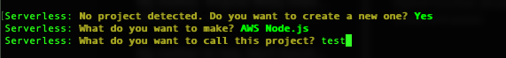
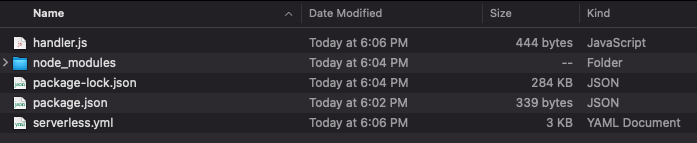

# Installation

## Requirements

Hybridless is directly coupled with the `serverless` framework and therefore is the only dependecy required for it to work. All other dependecies for javascript as `webpack` and `babel` for example are handled and injected by the plugin during the development build and don't affect the total build/image size.

## Setup

### Minimal Setup

The minimal setup could be done as:

```bash
$ npm i -G serverless
$ serverless #to setup the project (run npm i -G serverless if cmd not found)

###AFTER SETUP

$ cd example
$ npm init -y
$ npm i -D serverless @hybridless/hybridless
```




 Even if you are not developing on javascript or have any code, deployment is done via javascript and you are required to have the package.json and serverless.yml on the folder you are building \(commonly on the root directory of the project\).


Once you have completed the steps above, you should have the following structure.



Now, on your **serverless.yml** file, you should include the plugin on the top and everything can be left untouched or erased at the point you have only the following.


```yaml
service: example
plugins:
  - '@hybridless/hybridless'
provider:
  name: aws
  runtime: nodejs12.x
  stage: ${opt:stage, 'dev'}
  region: ${opt:region, 'ca-central-1'}
  memorySize: 512
  timeout: 30
  environment: ${file(env.yml):${self:custom.stage}}
```


### Configuring Environments

As a good practice, we should always create an **env.yml** file at the root of your directory to handle multiple stages environments as follow. If you are not using **env.yml** based on the stages or not using it at all, you **should change** the `serverless.yml line 11` accordingly. 

```yaml
dev:
    APP_NAME: 'Example dev'
stage:
    APP_NAME: 'Example stage'
prod:
    APP_NAME: 'Example'
```

### Configuring Webpack


