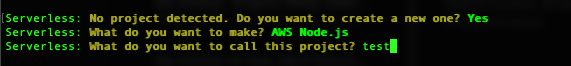

# Setup

The minimal setup could be done as:

```bash
$ npm i -G serverless
$ serverless #to setup the project (run npm i -G serverless if cmd not found)

###AFTER SETUP

$ cd example
$ npm init -y
$ npm i -D serverless @hybridless/hybridless
```




 Even if you are not developing on javascript or have any code, deployment is done via javascript and you are required to have the package.json and serverless.yml on the folder you are building \(commonly on the root directory of the project\).


Once you have completed the steps above, you should have the following structure.


Now, on your **serverless.yml** file, you should include the plugin on the top and everything can be left untouched or erased at the point you have only the following if you want a cleaner file. 


```yaml
service: example
plugins:
  - '@hybridless/hybridless'
provider:
  name: aws
  runtime: nodejs12.x
  stage: ${opt:stage, 'dev'}
  region: ${opt:region, 'ca-central-1'}
  memorySize: 512
  timeout: 30
  environment: ${file(env.yml):${self:custom.stage}}
```


### 

